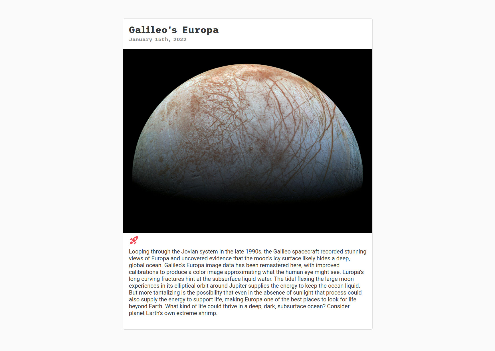
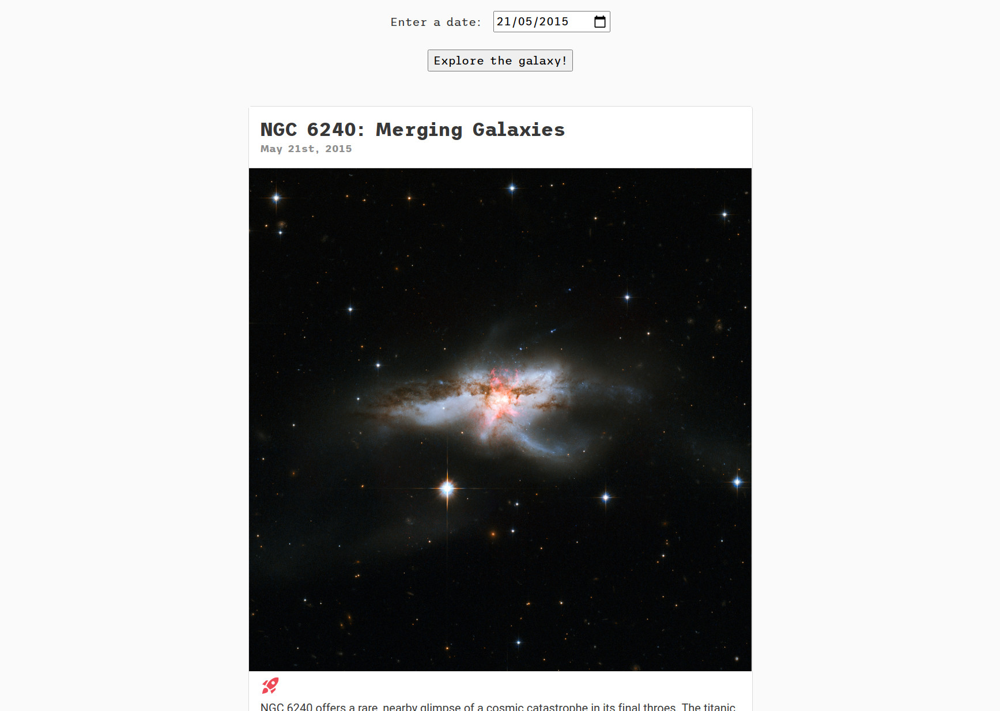
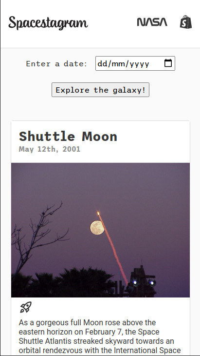

<!--
*** Thanks for checking out the Best-README-Template. If you have a suggestion
*** that would make this better, please fork the repo and create a pull request
*** or simply open an issue with the tag "enhancement".
*** Don't forget to give the project a star!
*** Thanks again! Now go create something AMAZING! :D
-->

<!-- PROJECT SHIELDS -->
<!--
*** I'm using markdown "reference style" links for readability.
*** Reference links are enclosed in brackets [ ] instead of parentheses ( ).
*** See the bottom of this document for the declaration of the reference variables
*** for contributors-url, forks-url, etc. This is an optional, concise syntax you may use.
*** https://www.markdownguide.org/basic-syntax/#reference-style-links
-->

<!-- [![Contributors][contributors-shield]][contributors-url]
[![Forks][forks-shield]][forks-url]
[![Stargazers][stars-shield]][stars-url]
[![Issues][issues-shield]][issues-url]
[![MIT License][license-shield]][license-url] -->

[![LinkedIn][linkedin-shield]][linkedin-url]

<!-- PROJECT LOGO -->
 

  

<h3 align="center">Spacestagram - Front End Developer Intern Challenge - Summer 2022</h3>

  

    An Instagram style photo feed featuring NASA Astronomy Picture of the Day.
     
    <a href="https://github.com/craigmclean39/shopify-fe-challenge"><strong>Explore the docs »</strong></a>
     
     
    <a href="https://craigmclean39.github.io/shopify-fe-challenge/">View Demo</a>
    ·
    <a href="https://github.com/craigmclean39/shopify-fe-challenge/issues">Report Bug</a>
    ·
    <a href="https://github.com/craigmclean39/shopify-fe-challenge/issues">Request Feature</a>
  

<!-- TABLE OF CONTENTS -->

  
<h2 style="display: inline-block">Table of Contents</h2>

  <ol>
    <li>
      <a href="#about-the-project">About The Project</a>
      <ul>
        <li><a href="#built-with">Built With</a></li>
        <li><a href="#libraries-used">Libraries Used</a></li>
      </ul>
    </li>
    <li>
      <a href="#getting-started">Getting Started</a>
    </li>
    <li><a href="#features">Features</a></li>
    <li><a href="#contact">Contact</a></li>
    <li><a href="#acknowledgements">Acknowledgements</a></li>
  </ol>

<!-- ABOUT THE PROJECT -->

## About The Project

[![Product Name Screen Shot][product-screenshot]](https://craigmclean39.github.io/shopify-fe-challenge/)

This project was created to meet the brief found <a href="https://docs.google.com/document/d/13zXpyrC2yGxoLXKktxw2VJG2Jw8SdUfliLM-bYQLjqE/edit#heading=h.31w9woubunro">here</a>, as part of the Shopify Intern challenge. I utilized the NASA APOD (Astronomy Photo of the Day) API to grab recent photos and display them in an instagram style feed.

(<a href="#top">back to top</a>)

### Built With

- [JavaScript](https://developer.mozilla.org/en-US/docs/Web/JavaScript)
- [CSS](https://developer.mozilla.org/en-US/docs/Web/CSS)
- [React.js](https://reactjs.org/)
- [Typescript](https://www.typescriptlang.org/)

### Libraries Used

- [date-fns](https://date-fns.org/)

(<a href="#top">back to top</a>)

<!-- GETTING STARTED -->

## Getting Started

Take a look at the demo <a href="https://craigmclean39.github.io/shopify-fe-challenge/">here.</a>

## Features

- View recent NASA APOD images and descriptions. 
- Like/Unlike images. Data on likes is stored in local storage using the Web Storage API 
  

- Select a date to view the image from that date. 
  
- Full mobile support 
  

<!-- CONTACT -->

## Contact

Craig McLean - craig@craigmclean.dev 
https://www.linkedin.com/in/mcleancraig/

Project Link: [https://github.com/craigmclean39/shopify-fe-challenge](https://github.com/craigmclean39/shopify-fe-challenge)

(<a href="#top">back to top</a>)

<!-- ACKNOWLEDGMENTS -->

## Acknowledgments

- [NASA](https://www.nasa.gov/)
- [Shopify](https://www.shopify.com/)
- [Google Fonts](https://fonts.google.com/)

(<a href="#top">back to top</a>)

<!-- MARKDOWN LINKS & IMAGES -->
<!-- https://www.markdownguide.org/basic-syntax/#reference-style-links -->

[linkedin-shield]: https://img.shields.io/badge/-LinkedIn-black.svg?style=for-the-badge&logo=linkedin&colorB=555
[linkedin-url]: https://www.linkedin.com/in/mcleancraig/
[product-screenshot]: ./readme/spacestagram.png
